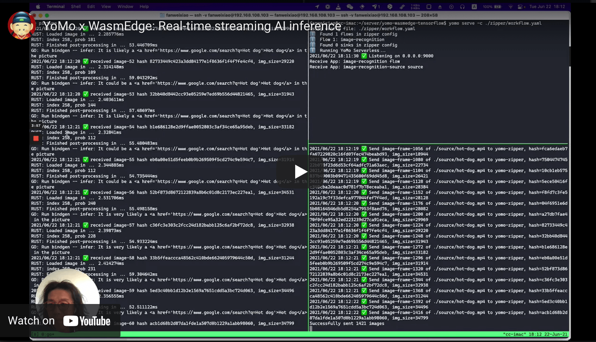
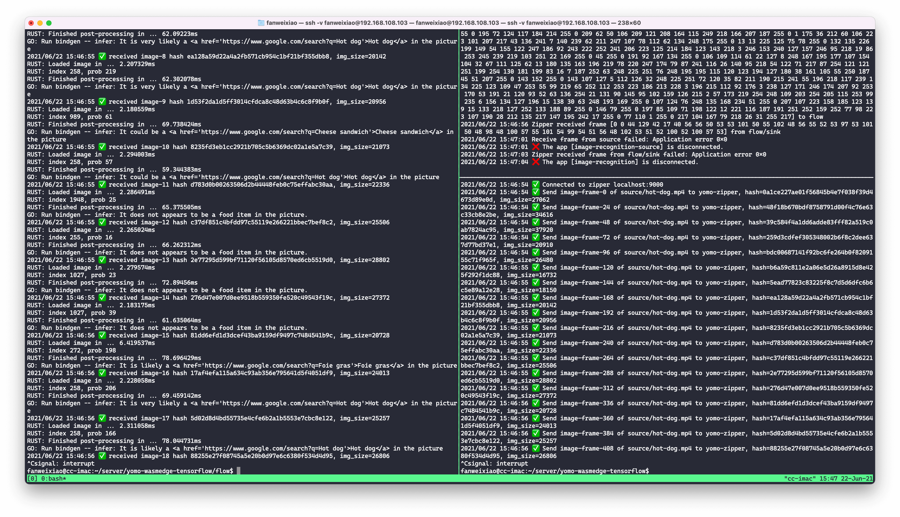

# Streaming Image Recognition by WebAssembly

[](https://youtu.be/E0ltsn6cLIU)

This project demonstrates how to process a video stream in real-time using WebAssembly and apply a pre-trained [food classification model](https://tfhub.dev/google/lite-model/aiy/vision/classifier/food_V1/1) to each frame of the video in order to determine if food is present in that frame, all by integrating [WasmEdge](https://github.com/WasmEdge/WasmEdge) into [YoMo](https://github.com/yomorun/yomo) serverless.

Open-source projects that we used:

- Serverless stream processing framework [YoMo](https://github.com/yomorun/yomo)
- Integrate with [WasmEdge](https://github.com/WasmEdge/WasmEdge) to introduce WebAssembly, interop TensorFlow Lite model
- A deep learning model found on [TensorFlow Hub](https://tfhub.dev/google/lite-model/aiy/vision/classifier/food_V1/1); make sure to download `TFLite (aiy/vision/classifier/food_V1)`, which was created by Google

**Advantages:**

- ⚡️ **Low-latency**: Streaming data processing applications can now be done in far edge data centers thanks to YoMo's highly efficient network services
- 🔐 **Security**: WasmEdge runs the data processing function in a WebAssembly sandbox for isolation, safety, and hot deployment
- 🚀 **High Performance**: Compared with popular containers, such as Docker, WasmEdge can be up to 100x faster at startup and have a much smaller footprint
- 🎯 **Edge Devices**: As WasmEdge consumes much less resources than Docker, it is now possible to run data processing applications on edge devices

## Steps to run

### 1. Clone This Repository

```bash
$ git clone https://github.com/yomorun/yomo-wasmedge-tensorflow.git
```

### 2. Install YoMo CLI

```bash
$ go install github.com/yomorun/cli/yomo@latest
$ yomo version
YoMo CLI version: v1.0.2
```
Details about `YoMo CLI` installation can be found [here](https://github.com/yomorun/yomo).

### 3. Install WasmEdge Dependencies

#### Install WasmEdge with its [Tensorflow and image processing extensions](https://www.secondstate.io/articles/wasi-tensorflow/)

```bash
wget -qO- https://raw.githubusercontent.com/WasmEdge/WasmEdge/master/utils/install.sh | bash -s -- -e all -p /usr/local
```

If you have any questions about installation, please refer to [the official documentation](https://github.com/WasmEdge/WasmEdge/blob/master/docs/install.md). Currently, this project works on Linux machines only.

#### Install video and image processing dependencies

```bash
$ sudo apt-get update
$ sudo apt-get install -y ffmpeg libjpeg-dev libpng-dev
```

### 4. Write your Streaming Serverless function

Write [app.go](https://github.com/yomorun/yomo-wasmedge-tensorflow/blob/main/flow/app.go) to integrate `WasmEdge-tensorflow`:

Get `WasmEdge-go`:

```bash
$ cd flow
$ go get -u github.com/second-state/WasmEdge-go/wasmedge
```

### 5. Run YoMo Orchestrator Server

```bash
  $ yomo serve -c ./zipper/workflow.yaml
```

### 6. Run Streaming Serverless function

```bash
$ cd flow
$ go run -tags tensorflow,image app.go
```

### 7. Demonstrate video stream

Download [this demo video: hot-dog.mp4](https://github.com/yomorun/yomo-wasmedge-tensorflow/releases/download/v0.2.0/hot-dog.mp4), store to `source` directory, then run：

```bash
$ wget -P source 'https://github.com/yomorun/yomo-wasmedge-tensorflow/releases/download/v0.2.0/hot-dog.mp4'
$ go run ./source/main.go ./source/hot-dog.mp4
```

### 8. Result


